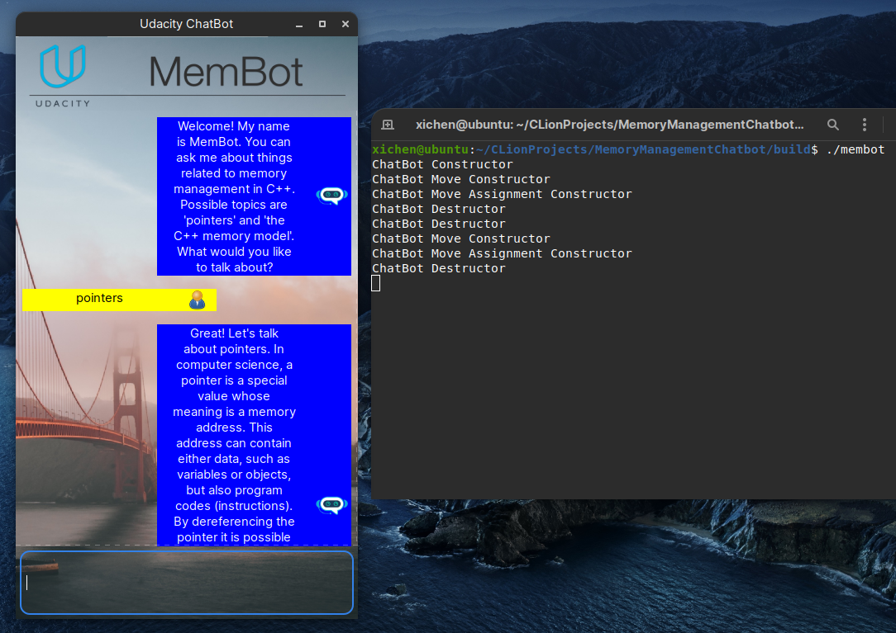

# Memory Management Chat Bot


The ChatBot code creates a dialogue where users can ask questions about some aspects of memory management in C++. After the knowledge base of the chatbot has been loaded from a text file, a knowledge graph representation is created in computer memory, where chatbot answers represent the graph nodes and user queries represent the graph edges. After a user query has been sent to the chatbot, the Levenshtein distance is used to identify the most probable answer.

It is developed and tested on Ubuntu 20.04.



## Cloning
```
git clone https://github.com/xichen-de/MemoryManagementChatbot.git
``` 

## Dependencies
* cmake >= 3.11
* make >= 4.1
* gcc/g++ >= 5.4
* wxWidgets >= 3.0

## Compiling

To compile the project, first, create a `build` directory and change to that directory:

```
mkdir build && cd build
```

From within the `build` directory, then run `cmake` and `make` as follows:

```
cmake ..
make
```

## Running

The executable will be placed in the `build` directory. From within `build`, you can run the project as follows:

```
./membot
```
